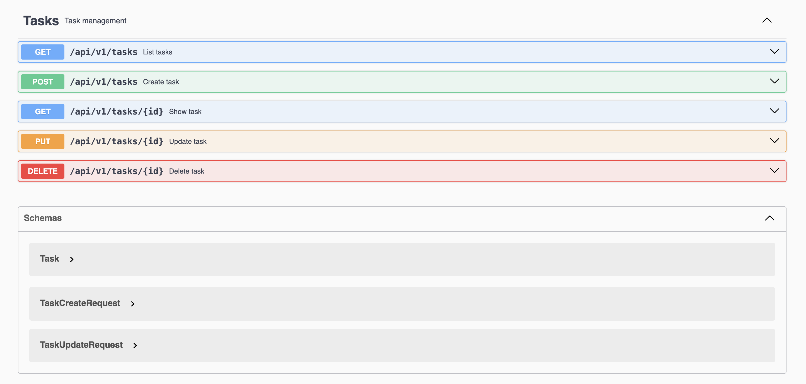

# Laravel API + OpenAPI (Swagger)

This repository demonstrates a **production-style Laravel REST API**
documented with **OpenAPI 3.0 (Swagger)**.

The goal is to showcase:
- OpenAPI-driven API design
- CRUD operations with persistence
- Validation & Resources
- Versioned endpoints
- Realistic backend use case

## Architecture Overview

The application follows common backend best practices. Controllers act as thin HTTP adapters, validation is handled via dedicated Form Request classes, persistence is managed through Eloquent models, and all API responses are returned exclusively through Resource classes. Routing is RESTful and versioned.

Request flow: HTTP Request → Controller → Validation → Model → Resource → JSON Response.

## API Documentation (Swagger)

The API is fully documented using OpenAPI 3.0 annotations. Swagger UI provides endpoint descriptions, request body schemas, path parameters, response schemas, and HTTP status codes.

Once generated, the documentation is available at:

/api/documentation

## API Testing (Postman & Feature Tests)

### Postman Collection

A ready-to-use Postman collection is included for testing all CRUD endpoints.

Location:
docs/postman/laravel-api-tasks.postman_collection.json

How to use:
1. Import the collection into Postman  
2. Set the base_url environment variable  
3. Execute Create / Read / Update / Delete requests  

The collection mirrors the OpenAPI documentation and allows fast validation of all endpoints.

### Feature Tests (Laravel)

CRUD functionality is covered with Laravel Feature tests.

Location:
tests/Feature/TaskApiTest.php

Covered:
- Create task
- Validation errors
- Fetch single task
- Update task
- Delete task
- Database assertions
- HTTP status validation

These tests ensure API correctness and alignment with the OpenAPI contract.

## Running the Project Locally

Setup:
composer install
cp .env.example .env
php artisan key:generate

Database:
Configure database credentials in `.env`, then run:
php artisan migrate

Swagger:
Generate API documentation:
php artisan l5-swagger:generate

Run server:
php artisan serve

API base URL:
http://127.0.0.1:8000/api/v1

## Project Scope

This project focuses on application-layer API design. Authentication, frontend integration, and advanced infrastructure concerns are intentionally omitted to keep the emphasis on API structure, data flow, documentation, and code clarity.

## CI & Documentation

This project includes a GitHub Actions workflow that validates the
application build, generates Swagger documentation, and runs automated
tests on every push and pull request.

The CI pipeline ensures that the API structure, documentation, and
application setup remain consistent and reproducible.

## Changelog

See [CHANGELOG.md](CHANGELOG.md) for version history and notable changes.

## License

MIT
